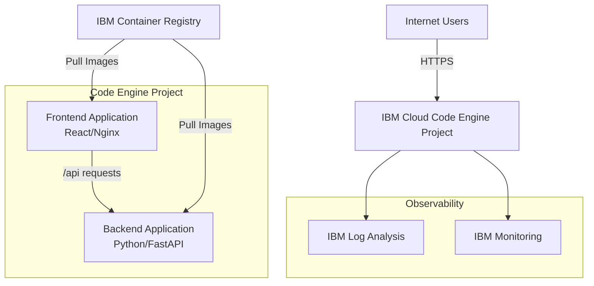

# IBM Cloud Migration Plan

## Executive Summary

This document outlines the strategy for migrating the Galaxium Travels Booking System from AWS to IBM Cloud. The migration involves containerized applications currently running on AWS ECS Fargate, with supporting infrastructure including load balancing, networking, and container registry services.

---

## Current AWS Architecture Analysis

### Components in Use

| AWS Service | Purpose | Configuration |
|------------|---------|---------------|
| **ECS Fargate** | Container orchestration | 2 services (backend, frontend) |
| **ECR** | Container registry | 2 repositories |
| **Application Load Balancer** | Traffic routing | Path-based routing (/api/* → backend) |
| **VPC** | Network isolation | 10.0.0.0/16, 2 AZs |
| **NAT Gateway** | Outbound internet for private subnets | Single NAT gateway |
| **CloudWatch** | Logging and monitoring | Log groups per service |
| **IAM** | Access control | Task execution and task roles |
| **Auto Scaling** | Dynamic scaling | Target tracking on CPU |

### Application Architecture

```
Internet → ALB → ECS Tasks (Fargate)
                 ├─ Backend (Python/FastAPI, port 8080)
                 └─ Frontend (React/Nginx, port 80)
```

**Key Characteristics:**
- Containerized microservices architecture
- Stateless applications (SQLite embedded in backend container)
- Path-based routing at load balancer level
- Health checks on both services
- Auto-scaling based on CPU utilization
- Demo data re-seeded on container start

---

## IBM Cloud Service Mapping

### Option 1: IBM Cloud Code Engine (Recommended for Demo/Dev)

| AWS Service | IBM Cloud Equivalent | Notes |
|------------|---------------------|-------|
| ECS Fargate | **Code Engine** | Serverless container platform, simpler than Kubernetes |
| ECR | **IBM Container Registry** | Integrated with Code Engine |
| ALB | **Code Engine built-in routing** | Automatic HTTPS, custom domains supported |
| VPC | **Code Engine managed networking** | Abstracted away, private endpoints available |
| NAT Gateway | Not needed | Managed by Code Engine |
| CloudWatch | **IBM Log Analysis** + **IBM Monitoring** | Integrated logging and metrics |
| IAM | **IBM Cloud IAM** | Service IDs and API keys |
| Auto Scaling | **Code Engine auto-scaling** | Built-in, scales to zero |

**Advantages:**
- ✅ Simpler deployment model (no cluster management)
- ✅ Scales to zero (cost savings)
- ✅ Built-in HTTPS and custom domains
- ✅ Faster deployment times
- ✅ Lower operational overhead
- ✅ Pay only for actual usage (per 100ms)

**Disadvantages:**
- ⚠️ Less control over networking
- ⚠️ Limited to HTTP/HTTPS workloads
- ⚠️ Maximum 10-minute request timeout

### Option 2: IBM Cloud Kubernetes Service (IKS)

| AWS Service | IBM Cloud Equivalent | Notes |
|------------|---------------------|-------|
| ECS Fargate | **IKS with Virtual Private Cloud** | Full Kubernetes control |
| ECR | **IBM Container Registry** | Same as Code Engine |
| ALB | **Ingress Controller** or **VPC Load Balancer** | More configuration required |
| VPC | **IBM Cloud VPC** | Full VPC control |
| NAT Gateway | **Public Gateway** | Similar to AWS NAT Gateway |
| CloudWatch | **IBM Log Analysis** + **IBM Monitoring** | Same as Code Engine |
| IAM | **IBM Cloud IAM** | Same as Code Engine |
| Auto Scaling | **Horizontal Pod Autoscaler** | Kubernetes-native |

**Advantages:**
- ✅ Full Kubernetes control
- ✅ More networking options
- ✅ Better for complex microservices
- ✅ No timeout limitations
- ✅ Can run non-HTTP workloads

**Disadvantages:**
- ⚠️ More complex to manage
- ⚠️ Higher minimum costs (cluster always running)
- ⚠️ Requires Kubernetes expertise
- ⚠️ More configuration overhead

---

## Recommended Approach: IBM Cloud Code Engine

Given that this is a demo application with:
- Simple containerized architecture
- HTTP/HTTPS workloads only
- Need for cost optimization
- Desire for simplicity

**IBM Cloud Code Engine is the recommended choice.**

---

## IBM Cloud Code Engine Architecture



### Key Differences from AWS

1. **No Load Balancer Configuration**: Code Engine provides automatic routing
2. **No VPC Setup**: Networking is managed by the platform
3. **Automatic HTTPS**: Free TLS certificates included
4. **Scale to Zero**: Applications can scale down to 0 instances when idle
5. **Simpler IAM**: Service-to-service auth via service bindings

---

## Migration Considerations

### 1. Application Changes Required

#### Backend (Python/FastAPI)
- ✅ **No changes required** - Docker container runs as-is
- ⚠️ **Environment variables**: Update CORS_ORIGINS to use Code Engine URLs
- ⚠️ **Port**: Code Engine expects port 8080 by default (already configured)
- ✅ **Health checks**: `/api/` endpoint works as-is

#### Frontend (React/Nginx)
- ✅ **No changes required** - Docker container runs as-is
- ⚠️ **API URL**: Will use relative `/api` paths (works with Code Engine routing)
- ⚠️ **Port**: Need to configure Nginx to listen on port 8080 (Code Engine default)
- ✅ **Health checks**: `/health` endpoint works as-is

### 2. Data Persistence

**Current State**: SQLite embedded in backend container (ephemeral)

**Options for IBM Cloud**:

1. **Keep SQLite (Simplest)**
   - Data resets on container restart
   - Good for demos
   - No additional cost
   - ⚠️ Not suitable for production

2. **IBM Cloud Databases for PostgreSQL**
   - Managed PostgreSQL service
   - Persistent data
   - Automatic backups
   - ~$30-50/month minimum
   - Requires code changes to use PostgreSQL

3. **IBM Cloud Object Storage + SQLite**
   - Store SQLite file in Object Storage
   - Load on startup, save periodically
   - More complex but cheaper than managed DB
   - ~$5/month for storage

**Recommendation**: Keep SQLite for initial migration, evaluate persistent storage later.

### 3. Networking and Security

**AWS Current State**:
- Public subnets with ECS tasks
- Security groups for access control
- ALB for public access

**IBM Cloud Code Engine**:
- Applications are private by default
- Can expose via public endpoints
- Built-in DDoS protection
- Automatic TLS/HTTPS
- No security group configuration needed

**Security Considerations**:
- ✅ Code Engine provides better default security (private by default)
- ✅ Automatic HTTPS is more secure than AWS ALB HTTP
- ⚠️ Need to configure CORS properly for new domain
- ⚠️ Consider IBM Cloud Secrets Manager for sensitive data

### 4. CI/CD and Deployment

**AWS Current State**:
- Manual deployment via `deploy-to-aws.sh`
- Docker build → ECR push → ECS update

**IBM Cloud Options**:

1. **Manual Deployment** (similar to AWS)
   ```bash
   ibmcloud ce project create
   ibmcloud cr build
   ibmcloud ce application create
   ```

2. **IBM Cloud Toolchain** (recommended)
   - Integrated CI/CD
   - Git integration
   - Automatic builds on commit
   - Deployment pipelines

3. **GitHub Actions** (if using GitHub)
   - Use IBM Cloud CLI in actions
   - Deploy on merge to main

### 5. Monitoring and Logging

**AWS Current State**:
- CloudWatch Logs for application logs
- CloudWatch Metrics for performance

**IBM Cloud**:
- **IBM Log Analysis**: Centralized logging (similar to CloudWatch Logs)
- **IBM Monitoring**: Metrics and dashboards (similar to CloudWatch Metrics)
- **Code Engine built-in metrics**: Request count, latency, errors

**Setup Required**:
- Create Log Analysis instance
- Create Monitoring instance
- Configure Code Engine to send logs/metrics

### 6. Cost Comparison

#### AWS Current Costs (Scaled to Zero)
| Service | Monthly Cost |
|---------|-------------|
| NAT Gateway | $32 |
| Application Load Balancer | $16 |
| ECS Fargate (0 tasks) | $0 |
| ECR Storage | ~$1 |
| **Total (idle)** | **~$49/month** |

#### AWS Running Costs
| Service | Monthly Cost |
|---------|-------------|
| NAT Gateway | $32 |
| Application Load Balancer | $16 |
| ECS Fargate (2 tasks, 24/7) | $30 |
| ECR Storage | ~$1 |
| **Total (running)** | **~$79/month** |

#### IBM Cloud Code Engine Costs

**Pricing Model**: Pay per use (no idle costs)
- **vCPU**: $0.00003417 per vCPU-second
- **Memory**: $0.00000356 per GB-second
- **Requests**: First 100,000 free, then $0.40 per million

**Estimated Costs** (assuming 0.25 vCPU, 0.5 GB per instance):

| Usage Pattern | Monthly Cost |
|--------------|-------------|
| **Idle (scaled to zero)** | **$0** |
| **Light usage (1M requests/month)** | **~$5-10** |
| **Medium usage (10M requests/month)** | **~$20-30** |
| **24/7 running (2 instances)** | **~$35-45** |

**Additional Costs**:
- Container Registry: ~$5/month for storage
- Log Analysis: ~$0 (free tier) to $50/month
- Monitoring: ~$0 (free tier) to $30/month

**Cost Savings**:
- ✅ **No idle costs** when scaled to zero
- ✅ **No NAT Gateway** costs ($32/month savings)
- ✅ **No Load Balancer** costs ($16/month savings)
- ✅ **Pay only for actual usage**

**Estimated Total Savings**: **$30-50/month** for typical demo usage

---

## Migration Strategy

### Phase 1: Preparation (1-2 hours)

1. **Set up IBM Cloud Account**
   - Create IBM Cloud account (free tier available)
   - Install IBM Cloud CLI
   - Install Code Engine plugin
   - Configure authentication

2. **Create IBM Cloud Resources**
   - Create Resource Group
   - Create Code Engine project
   - Create Container Registry namespace
   - (Optional) Create Log Analysis instance
   - (Optional) Create Monitoring instance

3. **Review Application Configuration**
   - Identify environment variables
   - Document current CORS settings
   - Review health check endpoints
   - Check port configurations

### Phase 2: Container Migration (1-2 hours)

1. **Push Images to IBM Container Registry**
   - Build Docker images (same as AWS)
   - Tag for IBM Container Registry
   - Push to IBM CR

2. **Test Images Locally**
   - Pull from IBM CR
   - Run locally to verify
   - Test connectivity between services

### Phase 3: Deployment (1-2 hours)

1. **Deploy Backend Application**
   - Create Code Engine application
   - Configure environment variables
   - Set resource limits (CPU/memory)
   - Configure auto-scaling
   - Test health endpoint

2. **Deploy Frontend Application**
   - Create Code Engine application
   - Configure to route `/api/*` to backend
   - Set resource limits
   - Configure auto-scaling
   - Test application

3. **Configure Routing**
   - Set up custom domain (optional)
   - Configure CORS on backend
   - Test end-to-end flow

### Phase 4: Validation (30 minutes)

1. **Functional Testing**
   - Test user registration
   - Test flight search
   - Test booking creation
   - Test booking retrieval

2. **Performance Testing**
   - Load test with multiple users
   - Verify auto-scaling works
   - Check response times

3. **Monitoring Setup**
   - Verify logs are flowing
   - Check metrics are collected
   - Set up alerts (optional)

### Phase 5: Cleanup (30 minutes)

1. **AWS Teardown**
   - Run `./teardown-aws.sh`
   - Verify all resources deleted
   - Document final costs

2. **Documentation**
   - Update README with IBM Cloud instructions
   - Create deployment scripts for IBM Cloud
   - Document new URLs and endpoints

---

## Implementation Prerequisites

### Required Tools

1. **IBM Cloud CLI**
   ```bash
   # macOS
   curl -fsSL https://clis.cloud.ibm.com/install/osx | sh
   
   # Linux
   curl -fsSL https://clis.cloud.ibm.com/install/linux | sh
   ```

2. **Code Engine Plugin**
   ```bash
   ibmcloud plugin install code-engine
   ```

3. **Container Registry Plugin**
   ```bash
   ibmcloud plugin install container-registry
   ```

4. **Docker** (already installed)

5. **jq** (already installed)

### Required Accounts

1. **IBM Cloud Account**
   - Sign up at https://cloud.ibm.com
   - Free tier available (no credit card required for trial)
   - Lite plan includes:
     - Code Engine: 100,000 free vCPU-seconds/month
     - Container Registry: 500 MB free storage
     - Log Analysis: 500 MB/day free

### Required Permissions

- Administrator access to IBM Cloud account
- Ability to create resources in Resource Group
- Access to create Code Engine projects
- Access to push to Container Registry

---

## Key Differences and Gotchas

### 1. Port Configuration
- **AWS**: Backend on 8080, Frontend on 80
- **IBM Code Engine**: Both should use 8080 (default)
- **Action**: Update frontend Nginx config to listen on 8080

### 2. Environment Variables
- **AWS**: Set in ECS task definition
- **IBM Code Engine**: Set via CLI or console
- **Action**: Document all env vars and set in Code Engine

### 3. Health Checks
- **AWS**: Configured in ALB target groups
- **IBM Code Engine**: Configured per application
- **Action**: Ensure `/api/` and `/health` endpoints work

### 4. Logging
- **AWS**: Automatic to CloudWatch
- **IBM Code Engine**: Automatic to stdout, optional Log Analysis
- **Action**: Ensure apps log to stdout (already doing this)

### 5. Scaling
- **AWS**: Manual desired count, auto-scaling optional
- **IBM Code Engine**: Auto-scaling by default, can scale to zero
- **Action**: Configure min/max instances

### 6. Networking
- **AWS**: Explicit VPC, subnets, security groups
- **IBM Code Engine**: Managed networking, private by default
- **Action**: No VPC configuration needed

### 7. CORS Configuration
- **AWS**: Uses ALB DNS name
- **IBM Code Engine**: Uses Code Engine domain or custom domain
- **Action**: Update CORS_ORIGINS environment variable

---

## Risk Assessment

| Risk | Impact | Likelihood | Mitigation |
|------|--------|-----------|------------|
| Application doesn't work on Code Engine | High | Low | Test locally with IBM CR images first |
| Port configuration issues | Medium | Medium | Update Nginx config before deployment |
| CORS errors after migration | Medium | Medium | Test CORS with new domain before going live |
| Data loss during migration | Low | Low | SQLite is ephemeral anyway, demo data re-seeds |
| Cost overruns | Low | Low | Code Engine has free tier, set spending limits |
| Performance degradation | Medium | Low | Code Engine is generally faster than ECS |
| Downtime during migration | Low | N/A | This is a demo, no production traffic |

---

## Success Criteria

Migration is considered successful when:

1. ✅ Both frontend and backend are deployed to Code Engine
2. ✅ Application is accessible via public URL
3. ✅ All features work (search, book, view bookings)
4. ✅ Health checks pass
5. ✅ Logs are visible in IBM Cloud
6. ✅ Auto-scaling works (scales up under load)
7. ✅ Cost is lower than AWS (verified after 1 week)
8. ✅ Documentation is updated
9. ✅ AWS resources are torn down

---

## Next Steps

1. **Review this plan** with stakeholders
2. **Set up IBM Cloud account** and install CLI tools
3. **Create deployment scripts** for IBM Cloud (similar to AWS scripts)
4. **Execute Phase 1** (Preparation)
5. **Test migration** in IBM Cloud
6. **Tear down AWS** after successful validation

---

## Appendix: Quick Command Reference

### IBM Cloud CLI Commands

```bash
# Login
ibmcloud login

# Target resource group
ibmcloud target -g default

# Create Code Engine project
ibmcloud ce project create --name galaxium-booking

# Select project
ibmcloud ce project select --name galaxium-booking

# Build and push image
ibmcloud cr build --tag us.icr.io/galaxium/backend:latest ./booking_system_backend

# Create application
ibmcloud ce application create \
  --name backend \
  --image us.icr.io/galaxium/backend:latest \
  --port 8080 \
  --min-scale 0 \
  --max-scale 3 \
  --cpu 0.25 \
  --memory 0.5G \
  --env SEED_DEMO_DATA=true

# Get application URL
ibmcloud ce application get --name backend --output url

# View logs
ibmcloud ce application logs --name backend --follow

# Update application
ibmcloud ce application update --name backend --image us.icr.io/galaxium/backend:latest
```

---

**Document Version**: 1.0  
**Last Updated**: 2026-04-13  
**Author**: Migration Planning Team