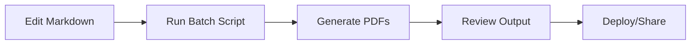

# 🚀 Galaxium Travels Knowledge Base

> **The Premier Luxury Space Travel Experience Provider** *(Fictional Company)*


Welcome to **Galaxium Travels**, a comprehensive knowledge base showcasing generative AI and RAG (Retrieval-Augmented Generation) capabilities through fictional space tourism company documentation.

---

## 📋 Table of Contents

- [Overview](#overview)
- [Directory Structure](#directory-structure)
- [Getting Started](#getting-started)
- [Asset Categories](#asset-categories)
- [Utilities & Tools](#utilities--tools)
- [Contributing](#contributing)
- [Usage Examples](#usage-examples)

---

## 🎯 Overview

This repository contains a complete set of company assets and documentation for Galaxium Travels, designed to demonstrate:

- **AI & RAG Capabilities** - Comprehensive knowledge base for testing retrieval systems
- **Document Management** - Structured organization of business documents
- **Content Generation** - Rich source material for AI training and testing
- **Business Process Documentation** - Real-world document types and workflows

---

## 📁 Directory Structure

```
galaxium-travels/
├── 01_corporate/
│   └── ...
├── 02_customer_service/
│   └── ...
├── 03_hr/
│   └── ...
├── 04_marketing/
│   └── ...
├── 05_legal/
│   └── ...
├── 06_technical/
│   └── ...
├── 07_finance/
│   └── ...
├── 08_it/
│   └── ...
├── 09_emergency/
│   └── ...
├── 97_raw_markdown_files/         # Source markdown files (edit here)
│   └── ... (mirrors main folders)
├── 98_utils/                      # PDF generation scripts & utils
│   ├── batch_md_to_pdf.py
│   ├── md_to_pdf_weasy.py
│   ├── md_pdf_style.css
│   └── created_pdfs/              # Output PDFs (mirrors structure)
├── 99_visual_assets/              # Logos and visual assets
│   └── ...
└── README.md
```

---

## 📝 How to Edit and Generate PDFs

1. **Edit Markdown:**
   - Make changes in the `97_raw_markdown_files/` directory. This mirrors the main folder structure.
   - Do **not** edit PDFs directly; always update the markdown source.

2. **Install Requirements:**
   - Ensure you have Python 3.7+.
   - Install dependencies:
     ```bash
     pip install -r 98_utils/requirements.txt
     ```

3. **Generate PDFs:**
   - Run the batch script from the project root:
     ```bash
     python 98_utils/batch_md_to_pdf.py
     ```
   - This will convert all markdown files (except those in the ignore list) to PDFs, placing them in `98_utils/created_pdfs/` with a mirrored folder structure.

4. **Styling & Assets:**
   - PDFs use `98_utils/md_pdf_style.css` for consistent branding.
   - Logos from `99_visual_assets/` are embedded in the PDFs automatically.

---

## 📚 Asset Categories

### 🏢 Corporate & Strategy
- **Company Overview** - Mission, vision, and corporate structure
- **Sustainability** - Environmental policies and initiatives
- **Strategic Planning** - Business objectives and roadmaps

### 🚀 Technical & Operations
- **Spacecraft Specifications** - Detailed vehicle documentation
- **Safety Protocols** - Training and certification materials
- **Crisis Management** - Emergency response procedures
- **System Architecture** - IT infrastructure and processes

### 💼 Marketing & Partnerships
- **Luxury Packages** - Premium travel experiences
- **Strategic Partnerships** - Business collaborations
- **Brand Guidelines** - Visual identity and messaging

### 👥 Human Resources
- **Employee Handbook** - Company policies and procedures
- **Training Materials** - Professional development resources
- **Safety Certification** - Space travel safety training

### 📋 Customer Service
- **Service Manuals** - Customer experience procedures
- **Quality Standards** - Service excellence guidelines
- **Support Resources** - Customer assistance materials

### ⚖️ Legal & Compliance
- **Terms of Service** - Legal agreements and policies
- **Regulatory Compliance** - Industry standards adherence

### 💰 Finance & Budget
- **Budget Planning** - Financial planning and forecasting
- **Cost Analysis** - Expense management and reporting

---

## 🛠️ Utilities & Tools

### Core Scripts

| Script | Purpose | Usage |
|--------|---------|-------|
| `batch_md_to_pdf.py` | Batch convert all markdown files | `python 98_utils/batch_md_to_pdf.py` |
| `md_to_pdf_weasy.py` | Single file conversion | `python 98_utils/md_to_pdf_weasy.py input.md` |
| `md_pdf_style.css` | PDF styling and branding | Automatically applied |

### Features

- **Automatic Structure Mirroring** - Maintains folder hierarchy
- **Brand Integration** - Embeds logos and styling automatically
- **Batch Processing** - Convert entire knowledge base at once
- **Custom Styling** - Professional PDF output with company branding

---

## 🔄 Workflow



### Best Practices

1. **Always edit** source markdown files in `97_raw_markdown_files/`
2. **Never modify** generated PDFs directly
3. **Use consistent** formatting and structure
4. **Test changes** with small batches first
5. **Maintain** folder structure consistency

---

## 💡 Usage Examples

### AI & RAG Demonstrations
- **Knowledge Retrieval** - Test document search and retrieval
- **Content Generation** - Generate responses based on company knowledge
- **Document Analysis** - Analyze business processes and procedures

### Business Applications
- **Training Development** - Create employee training materials
- **Process Documentation** - Document business workflows
- **Compliance Management** - Maintain regulatory documentation

### Research & Development
- **AI Model Testing** - Evaluate retrieval and generation capabilities
- **Content Analysis** - Study document structure and organization
- **Workflow Optimization** - Improve document management processes

---

## 🤝 Contributing

### Guidelines
- Maintain consistent folder structure
- Use clear, descriptive file names
- Follow markdown formatting standards
- Test PDF generation before committing
- Update this README when adding new categories

### File Naming Convention
- Use descriptive, lowercase names with underscores
- Include version numbers for major updates
- Group related files in appropriate subdirectories

---

## 📝 Notes

- **Fictional Company** - This is a demonstration project, not a real business
- **Educational Purpose** - Designed for AI/ML research and development
- **Open Source** - Available for educational and research purposes
- **Regular Updates** - Content is periodically updated and expanded

---

## 🔗 Related Resources

- **WeasyPrint Documentation** - [weasyprint.org](https://weasyprint.org/)
- **Markdown Guide** - [markdownguide.org](https://www.markdownguide.org/)
- **Python Documentation** - [python.org](https://python.org/)

---

## 📄 License

This project is open source and available under the [MIT License](LICENSE).

---

*Last updated: December 2024*

<div align="center">

**Ready to explore the future of space travel documentation? 🚀**

</div> 
